#  RemoVir   

## Este repositorio contiene todos los recursos: instrucciones, código, documentación y datos para ayudarte a reciclar un Split (evaporador interior de aire acondicionado) a un eficiente filtro HEPA

Podrás montar un **purificador de aire con filtro HEPA** por poco más del coste de los filtros y lo más importante. Ayudarás a mantener el medio ambiente mientras proteges del contagio de COVID-19 el espacio que más necesites.

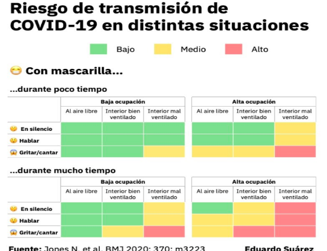

```text
Hemos querido enfocar nuestros esfuerzos a este tipo 
de dispositivos porque creemos que pueden ser una 
importante ayuda a evitar contagios. Las últimas 
evidencias científicas demuestran la transmisión de 
virus por aerosoles, es decir, por el mismo hecho de 
respirar. Esto aumenta el nivel de COV (Compuestos 
Orgánicos Volátiles entre los que se encuentra el 
virus SARS-CoV-2) algo que va correlacionado con la 
concentración de CO2. Esta evidencia hace necesaria 
una correcta ventilación de los espacios cerrados. 
Lo que es tan importante como mantener una distancia 
mínima.
```
<br>
<br>
<br>

Este proyecto parte de la iniciativa de Ernesto Gutiérrez [@erguro1973](https://twitter.com/erguro1973), de [Carlos Orts](https://github.com/McOrts) [@mcorts](https://twitter.com/mcorts) y de los asistentes a varios talleres realizados en el [Fablab de Mallorca](http://fablabmallorca.com/) y organizados por la [Asociación de Makers Mallorca](https://makespacemallorca.org/).

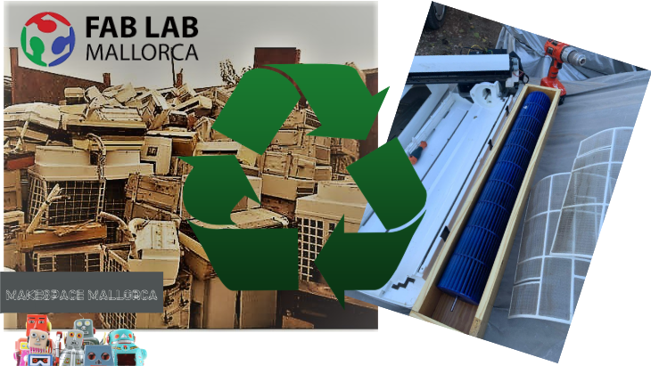

**¿Con que vamos a trabajar?**
* Análisis de dinámica de fluidos.
* Control de motores.
* Uso de filtros HEPA.
* Programación C++ e IDE de Arduino
* Microcontroladores ESP8266.
* Sensores
* Comunicaciones MQTT
<br>

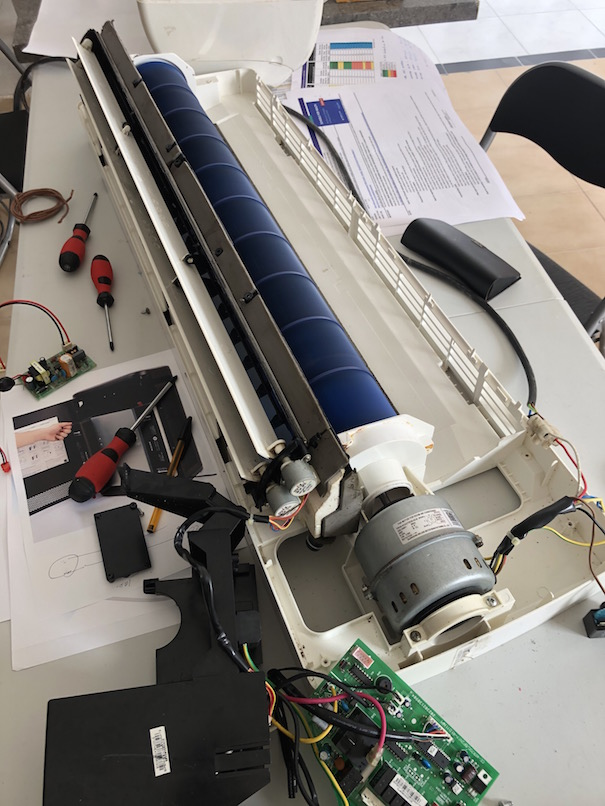

## Primer RemoVir, un _Mínimo Producto Viable_
Hemos trabajado sobre un Split marca Mundo Clima. Que ha resultado muy adecuado tanto para la sustitución de la electrócnica como para acomodar los filtros HEPA. Aunque se trata de un MPV. pretendemos que alcance un nivel H13 o superior según el estándar europeo EN 1822-1:2009. para ello se van a instalar 3 filtros HEPA H13 de un equipo profesional Honeywell Incorporaremos un completo sistemas de medición de calidad de aire, CO2, COV, temperatura, humedad y presión atmosférica de manera que sea capaz de adaptar su funcionamiento a las condiciones detectadas.

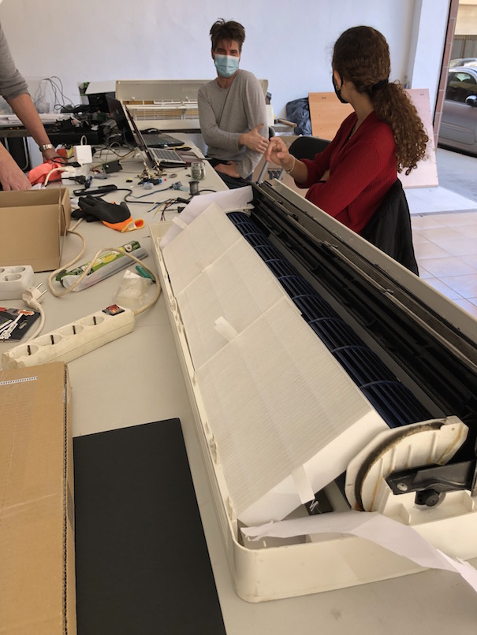

### Filtro HEPA (High Efficiency Particulate Air)
Un filtro HEPA funciona con diferentes principios. Lo que determina el comportamiento de la parte impulsora de aire. Una regla básica a tener en cuenta es que una mayor presión de aire puede bajar la eficiencia en la captura de componentes muy pequeños como virus.
El producto elegido ha sido el modelo empleado en el purificador profesional Honeywell H300 que incorpora filtros HEPA de grado H13
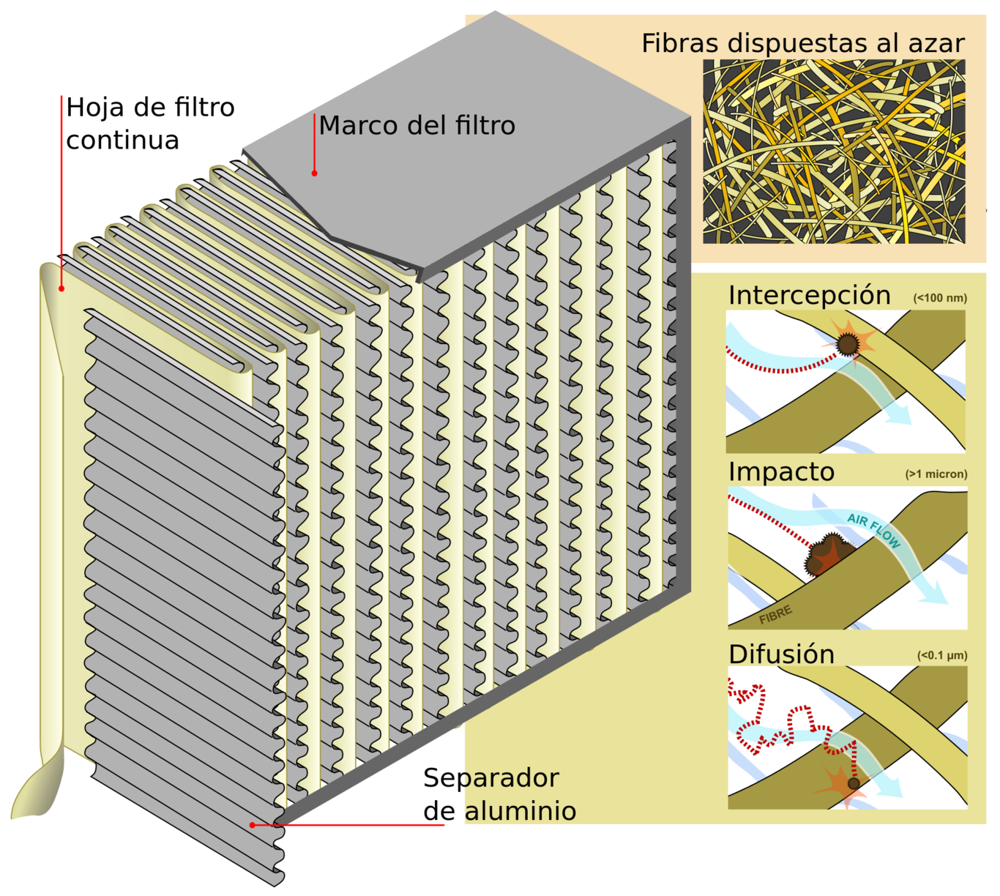

### Electrónica
Se ha planteado utilizar el WEMOS D1 MINI Pro. Que es un procesador tipo ESP8266 de 16 bits con programación nativa en C++.
El borrador del esquemático de momento es este:
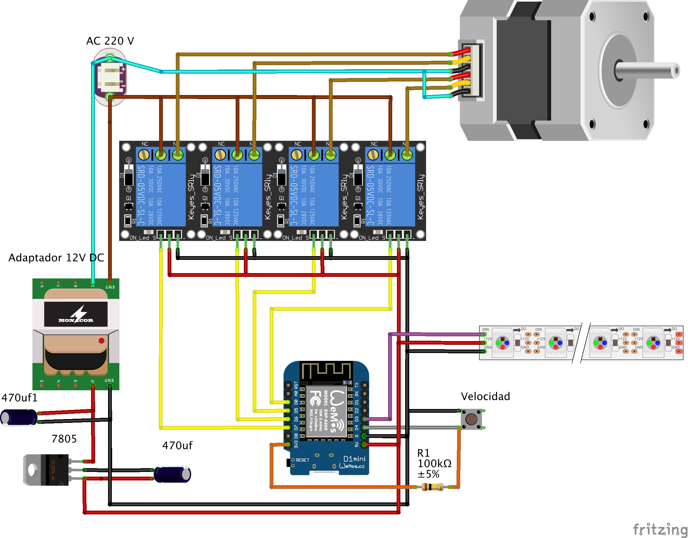

### Estructura
Hay que tener en cuenta que detro de un Split encontraremos un ´evaporizador´. A todos los efectos es un radiador de aluminio que sin formar parte de la estructura del aparato. Le confiere uan rigidez estructural que perderemos si no acomodamos los filtros HEPA teniendo en cuenta esta doble función. El diseño de las piezas adicionales evidentemente es una caso diferente para cada modelo. 
Como ejemplo de cómo hacerlo, se han usado patrones en cartulina que luego se han modelizado en SolidWorks para acabar imprimiendolos en 3D de filamento. Los ficheros podéis encontrarlos en este mismo repo.

### Flujo de aire
Este es un concepto que hay que tener presente durante todo el rediseño del equipo. Tanto en el aspecto de caudal como el de presión. Una cosa el el volumen de aire por hora que podamos hacer pasar el equipo y otra diferente es la presión que el ventilador pueda aplicar al aire que mueve. Evidentemente ambos parámetros se ven disminuidos respecto al modelo de aire acondicionado original al sustituir el evaporizador por los filtro HEPA que ofrecen mucha más resistencia al paso del aire.
No está de más valorar las modificaciones haciendo sencillas pruebas de flujo como esta:
[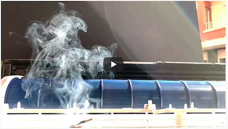](https://youtu.be/LHWRh8wFhkA)

### Montaje
El proceso de adaptación y transformación de la mecánica y la electrónica, es algo laborioso y nos ha ocupado algunas semanas. 
* Por una parte hemos tenido que resolver el problema de la sujección mecánica de los filtros en el lugar dejado por el elemento evaporador de aluminio. En un principio de diseñaron soportes imprimibles en 3D par los elementos perpendiculares. Ya que los para las piezas transversales, el material impreso no tienen la rigidez suficiente. Empezamos a utilizar tablero DM que finalmente se ha usado para todo:
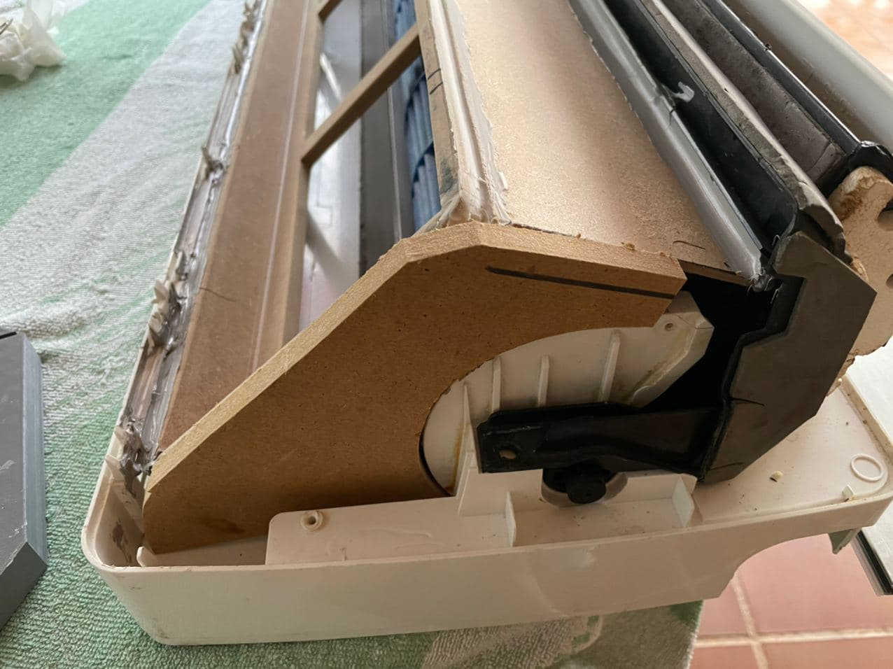

* En la parte electrónica se ha utilizado la fuente de alimentación original adaptando la tensión con reguladores de tensión. La lógica está programada en C++ corriendo en un microcesador tipo ESP8266 utilizando las mínimas librerias y un solo bloque de código. Aún así el control se puede hacer desde una página web servida directamente por el micro WEMOS D1 Mini PRO a modo de punto de acceso Wifi.
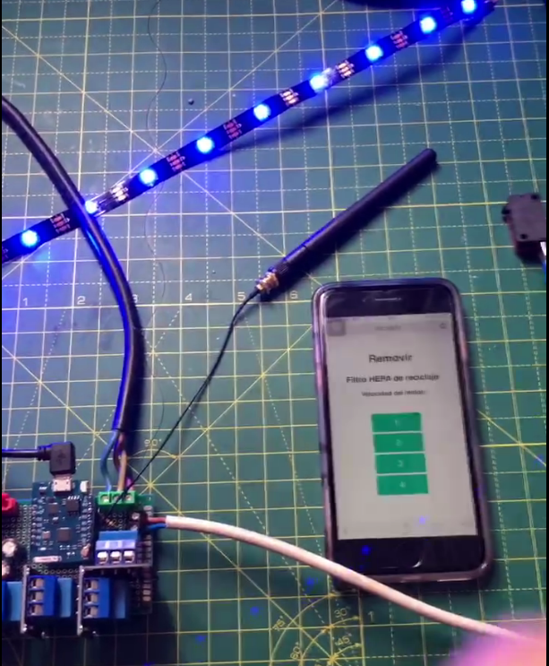

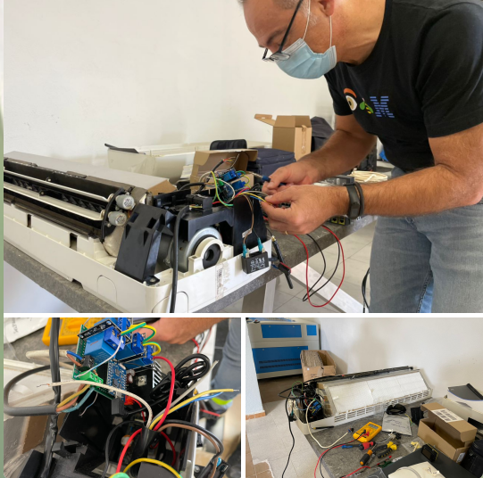
### Primera integración y prueba
El segundo sábado de diciembre, en una de las mañanas de _cacharrero_ organizadas por el Fablab de Mallorca. Hemos integrado todos los componentes y hecho la primera prueba de arranque del motor. Las sensaciones han sido buenas. Un nivel de ruido aceptable así como un caudal de salida de aire aparentemente bueno.
La electrónica parece que está afectada por interferencias que han deshabilitado la conexión wifi en algunos momentos. Y ha detectado falsas pulsaciones en el control manual. Vamos a sustiuir microprocesador, el WEMOS D1 Mini PRO por un WEMOS D1 Mini con encapsulaciento. 
[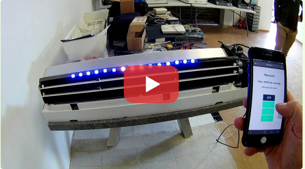](https://youtu.be/MKbnKUOGmzY)

### Mediciones y certificación
Como nos gusta saber si el trabajo está bien hecho, y sobre todo, si cumple su función. Una vez instalado mediremos los parámetros de operación como caudal de aire, reducción de COV, etc... para sacar conclusiones sobre mejoras en la siguiente iteracción.
<br>
Llegado el momento vamos a trabajar sobre la conocida hoja de excel de la Universidad de Hardvard que [tenéis aqui](https://github.com/Makespace-Mallorca/removir/blob/main/doc/Harvard-CU%20Boulder%20Portable%20Air%20Cleaner%20Calculator%20for%20Schools.v1.1.xlsx). Considerando esta plantilla se puede realizar el cálculo del CADR ( CLEAN AIR DELIVERY RATE) necesario del purificador, según el tamaño de la habitación, siendo este un parámetro que se indica en todos estos tipos de elementos. Como orientación, para una habitación media de 50m2 y un nivel de renovación bajo sería necesario al menos uno aparato con capacidad de 400 l/min.


